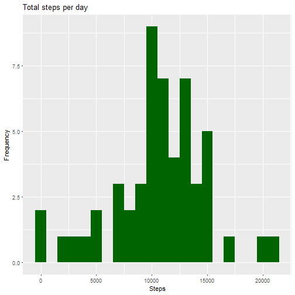
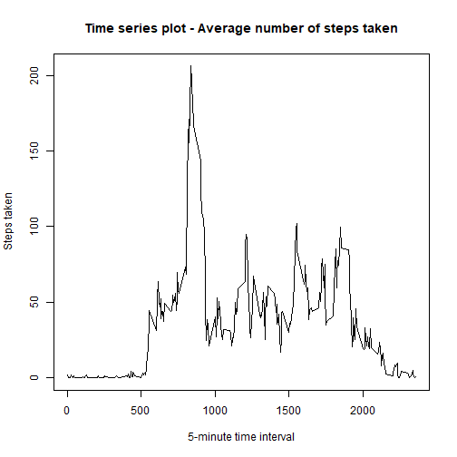
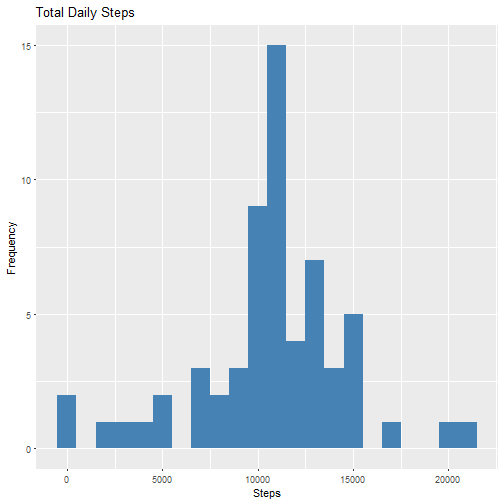
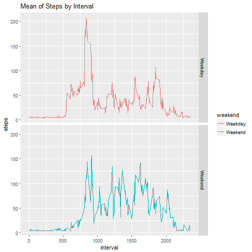

#Reproducible Research: Peer Assessment 1

##Loading and preprocessing the data

####1. Load the data (i.e. read.csv())


```r
act.df <- read.csv("activity\\activity.csv", na.strings = "NA")
```
***
####2. Process/transform the data (if necessary) into a format suitable for your analysis

```r
act.df$date <- as.Date(as.character(act.df$date))
```
***
##What is mean total number of steps taken per day?
***

####1. Calculate the total number of steps taken per day

```r
act.df.filter <- act.df[!(is.na(act.df$steps)),]
act.df.filter.dt <- data.table(act.df.filter)
steps.per.day <- as.data.frame(act.df.filter.dt[,sum(steps), by = date])
names(steps.per.day)[2] <- "steps"
```
***
####2. Make a histogram of the total number of steps taken each day

```r
ggplot(steps.per.day, aes(x=steps.per.day$steps)) +
  geom_histogram(fill = "darkgreen", binwidth=1000) +
  labs(title = "Total steps per day", x = "Steps", y = "Frequency")   
```


####3. Calculate and report the mean and median of the total number of steps taken per day

```r
mean(steps.per.day$steps, na.rm = TRUE)
```

```
## [1] 10766.19
```

```r
median(steps.per.day[[2]], na.rm = TRUE)
```

```
## [1] 10765
```
***
##What is the average daily activity pattern?
***
####1. Make a time series plot (i.e. type = "l") of the 5-minute interval (x-axis) and the average number of steps taken, averaged across all days (y-axis)
***

```r
steps.by.interval <- as.data.frame(act.df.filter.dt[,mean(steps), by = interval])
names(steps.by.interval)[2] <- "steps"
plot(steps.by.interval, type="l", main="Time series plot - Average number of steps taken", xlab("5-minute time interval"), ylab("Steps taken"))
```


***
####2. Which 5-minute interval, on average across all the days in the dataset, contains the maximum number of steps?
***

```r
steps.by.interval[steps.by.interval$steps == max(steps.by.interval[[2]]),]
```

```
##     interval    steps
## 104      835 206.1698
```
***
##Imputing missing values
***
####1. Calculate and report the total number of missing values in the dataset (i.e. the total number of rows with NAs)

```r
act.df.NA <- act.df[(is.na(act.df$steps)),]
nrow(act.df.NA)
```

```
## [1] 2304
```
***
####2. Devise a strategy for filling in all of the missing values in the dataset.
***
####3. Create a new dataset that is equal to the original dataset but with the missing data filled in.
***

```r
act.df.New <- act.df
act.df.NonNA <- act.df.New[!(is.na(act.df.New$steps)),]
act.df.NA <- act.df.New[(is.na(act.df.New$steps)),]
act.df.New$steps <- with(act.df.New, impute(steps, mean))
```
***
####4A. Make a histogram of the total number of steps taken each day 

```r
act.df.New.By.Day <- aggregate(act.df.New$steps, by=list(act.df.New$date), sum)
names(act.df.New.By.Day)[1] = "date"
names(act.df.New.By.Day)[2] = "steps"
ggplot(act.df.New.By.Day, aes(x=act.df.New.By.Day$steps)) +
  geom_histogram(fill = "steelblue", binwidth=1000) +
  labs(title = "Total Daily Steps", x = "Steps", y = "Frequency")
```


***
####4B. Calculate and report the mean and median total number of steps taken per day.

```r
mean(act.df.New.By.Day[[2]], na.rm = TRUE)
```

```
## [1] 10766.19
```

```r
median(act.df.New.By.Day[[2]], na.rm = TRUE)
```

```
## [1] 10766.19
```
***
####4C. Do these values differ from the estimates from the first part of the assignment? What is the impact of imputing missing data on the estimates of the total daily number of steps?
***
#####Mean is same but median has changed by 1.19 to 10766.19

***
##Are there differences in activity patterns between weekdays and weekends?
***
####1. Create a new factor variable in the dataset with two levels - "weekday" and "weekend" indicating whether a given date is a weekday or weekend day.

```r
act.df.filter.week <- act.df.New
act.df.filter.week$weekdays <- weekdays(as.Date(act.df.filter.week$date))
act.df.filter.week$weekend <- ifelse((act.df.filter.week$weekdays %in% c("Saturday","Sunday")), "Weekend", "Weekday")
```
***

####2. Make a panel plot containing a time series plot (i.e. type = "l") of the 5-minute interval (x-axis) and the average number of steps taken, averaged across all weekday days or weekend days (y-axis).


```r
act.df.filter.week.agg <- aggregate(act.df.filter.week$steps, by=list(act.df.filter.week$weekend, act.df.filter.week$interval), mean)
names(act.df.filter.week.agg)[1] ="weekend"
names(act.df.filter.week.agg)[2] ="interval"
names(act.df.filter.week.agg)[3] ="steps"

ggplot(act.df.filter.week.agg, aes(x = interval, y=steps, color=weekend)) +
  geom_line() +
  facet_grid(weekend ~ .) +
  labs(title = "Mean of Steps by Interval", x = "interval", y = "steps")
```


***

